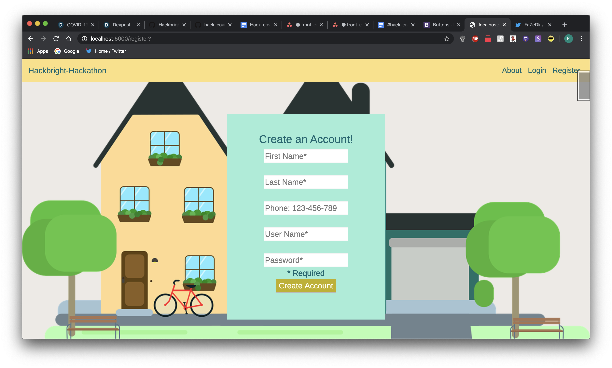
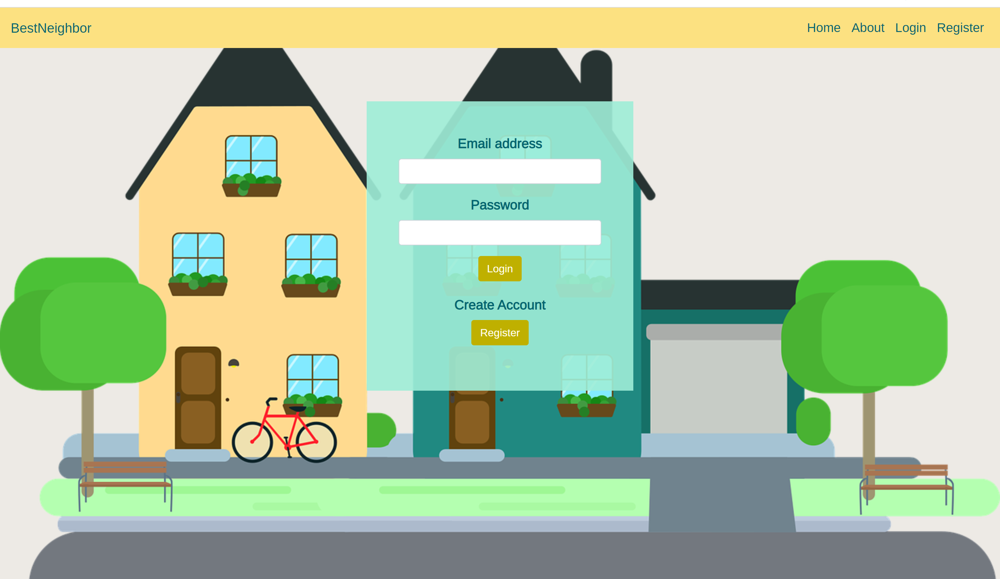
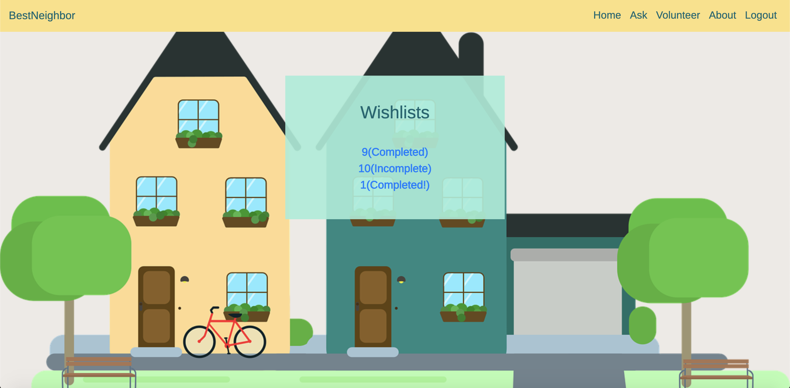
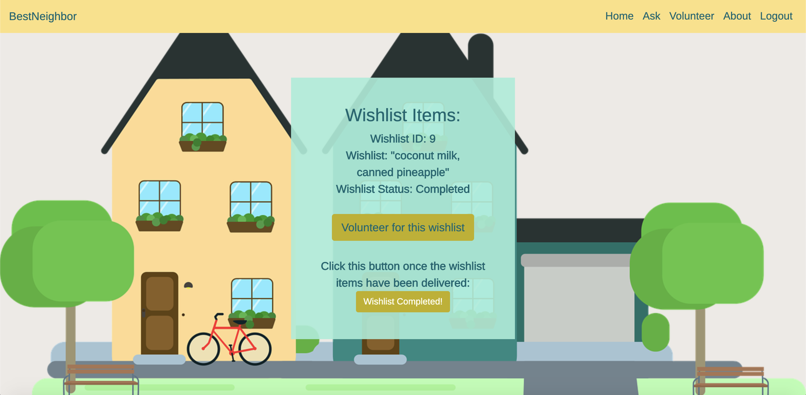
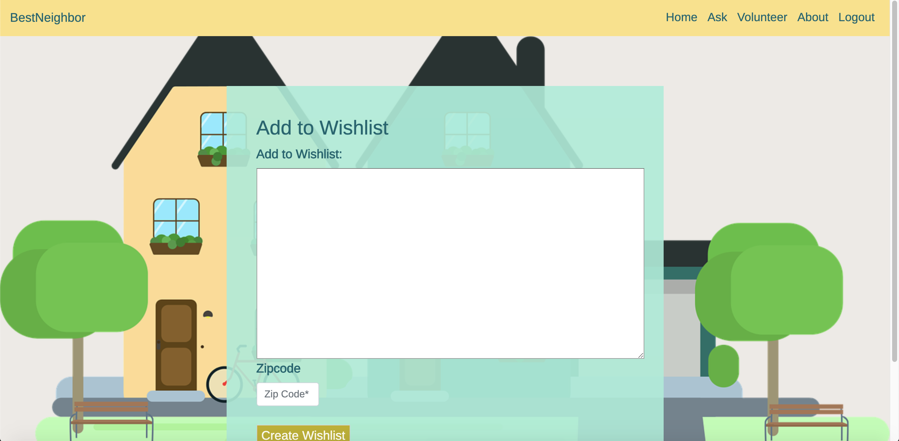

# BestNeighbor
### Inspiration
 
The COVID_19 pandemic has severely impacted the most vulnerable members of our community, and it has strained those working on the frontlines of the response. Our team wanted to provide our community with a tool where people in need can ask for help in getting grocery items, and volunteers can log in and provide the help. 

A user in need could range from a person whose health makes them vulnerable enough to leave the house, a healthcare worker who’s too busy in the frontlines to get groceries for their family, or a single parent who can’t leave their kids alone.

### What it does

Through BestNeighbor, a person in need of help can provide a wishlist of items they need from a local store along with their zip-code. Volunteers can log in and see wishlists available within a selected zip-code. The volunteer can shop for a wishlist that they selelct. The volunteer and requester will be able to contact each other and coordinate payment and delivery.

### How we built it

In 48-hours, our team brainstormed the project idea, built, integrated and tested the webapp using the following software stack:
- Backend: Postgresql, Flask, SqlAlchemy
- Frontend: HTML, CSS, Bootstrap

## Installation

### Prerequisites
- Python3
- PostgreSQL
- Flask
- SQLAlchemy

### Run BestNeighbor on your local computer:

Clone repository:

```
$ git clone https://github.com/Hackbright-Covid-19-Hackathon/hack-covid-19.git
```
Create and activate a virtual environment inside your local directory:
```
$ virtualenv env --always-copy  
$ source env/bin/activate
```

Install dependencies:
```
$ pip install -r requirements.txt
```
Create a database called volunteerdb:
```
$ createdb volunteerdb
```
Import the data:
```
python3 -i seed.py
```
Run the app from the command line:
```
$ python3 server.py
```
## Features

### Register

<br>

### Login

<br>

### Homepage
 <!-- 
  -->

<br>

### Volunteer pages

<br>

<br>

### Asker page

<br>


## What’s next
The following features are planned for implementation:
- Secure messaging within the webapp to keep user’s personal phone number and email private
- Ratings system for volunteers
- User verification


## About the Developers:

**BestNeighbor** was built by a team of recent software engineering academy grads. Below are their profiles:

- [**Johanna Kinsler**](https://www.linkedin.com/in/johanna-kinsler-76562463/) is a former automotive engineer and project manager turned software engineer. She is passionate about using data in decision making. She is looking for work in full stack, back end, and data engineering.

- [**Nichole Reyes**](https://www.linkedin.com/in/nicholereyes/) is a software engineer with 5 years of mechanical and project engineering experience. She's now in search of software engineering opportunities in a mission driven company. 

- [**Kimberly Chuc**](https://www.linkedin.com/in/kimberlymchuc/) is a former EMT turned software engineer. Her passion for problem solving and helping others inspires her to code, creating projects that make difficult tasks in life a lot easier. She looks forward to contributing her skills to her next role as a full stack engineer. 

- [**Amber Chan**](https://www.linkedin.com/in/amber-chan-38634396) is a software engineer with former recruiting and accounting experience. She’s excited to integrate her interpersonal and detail oriented skills from her previous roles in her next job! 

- [**Bahar Asefi**](https://www.linkedin.com/in/bahar-asefi-19154218a/) is an entrepreneur turned developer interested in backend and full stack engineering. 

- [**Yichen Dai**](https://www.linkedin.com/in/daiyichen/)
Previously a pioneer full-time world language teacher, with extensive experience in project planning, management and interpersonal communication. She also likes to be creative and solve problems, and she's deeply passionate about learning new technologies. Yichen has been learning Python and Javascript for the last year, and is excited to continue her growth as an software engineer and contribute to solve real life problem via technologies. 

- [**Jessica Huynh**](https://www.linkedin.com/in/jessicachauhuynh/)
Found a new interest in Full-Stack Web Development and currently learning the basics: HTML, CSS, Git, GitHub, Python and JavaScript.

- [**Lauren Maghran**](https://www.linkedin.com/in/lauren-maghran/) currently works in the environmental field, but is changing careers to software engineering. Lauren is a curious person, love learning, and appreciate clever solutions!


